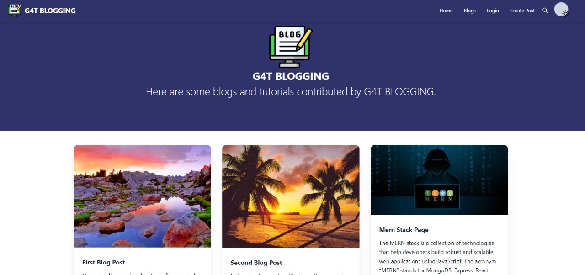

# 📝 Blog Website

A simple, responsive, and user-friendly blog website built using **React.js**, **Node.js**, **Express**, and **MongoDB**. This platform allows users to seamlessly create, edit, and delete blog posts, while also being able to view posts and engage through comments.

<!-- -->


## ✨ Features

- 🔑 **User Authentication**: Secure login/signup with JWT authentication.
- 📝 **Create, Edit, and Delete Blog Posts**: Effortlessly manage your blogs.
- 👀 **View Posts**: Browse through all posts, with individual post details.
- 💬 **Comment System**: Engage with posts by adding comments.
- 📱 **Responsive Design**: Optimized for all devices using **Bootstrap** and **Tailwind CSS**.
- 🔄 **RESTful API**: Backend built with **Express.js** and **MongoDB**.

## 🛠️ Tech Stack

### **Frontend:**
- ⚛️ **React.js**: For building dynamic user interfaces.
- 🎨 **Bootstrap** & **Tailwind CSS**: Ensures responsive and elegant designs.
- 🔗 **Axios**: To handle API requests and manage data communication with the backend.

### **Backend:**
- 🟢 **Node.js**: JavaScript runtime powering the backend.
- ⚡ **Express.js**: Lightweight and powerful framework for handling requests.
- 🍃 **MongoDB**: NoSQL database for storing users, blog posts, and comments.
- 🔐 **JWT**: Secure user authentication with JSON Web Tokens.
- 🔑 **bcrypt**: For safe password hashing.

## 🚀 Getting Started

To get a local copy up and running, follow these steps:

### Prerequisites

Before setting up the project, ensure you have the following installed:

- [Node.js](https://nodejs.org/) (version 14 or higher)
- [MongoDB](https://www.mongodb.com/) (either local or cloud-based)

### Installation

Follow these step-by-step instructions to clone and set up the project:

1. **Clone the repository**

   First, open your terminal and clone the repository from GitHub:

   ```bash
   git clone https://github.com/aman04k/Blog-Website.git
